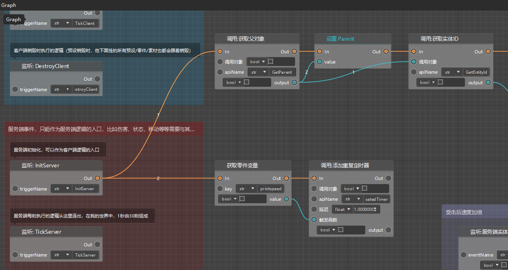
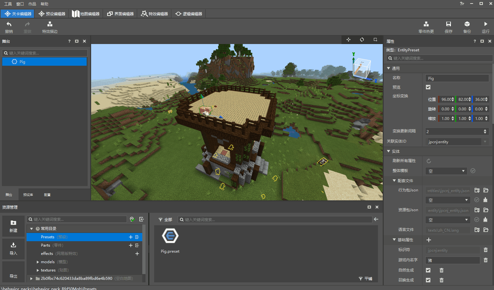

# 创建并挂接蓝图零件

在新版逻辑编辑器中，我们使用节点式编程的形式编写逻辑，而这些承载了节点与连线的图表，我们将其称为**蓝图**。

正如我们在之前的文档中介绍的那样，零件是预设架构下，一种可以挂接到预设下的玩法逻辑对象。而蓝图零件，顾名思义，则是一种使用蓝图编写零件逻辑的特殊零件，需要用新版逻辑编辑器进行编辑。

## 创建蓝图零件

我们可以使用新建文件向导创建蓝图零件。例如当前处于关卡编辑器界面，你可以点击左下角资源管理器的【新建】按钮打开新建文件向导，选择【蓝图零件】-【空蓝图零件】，然后点击【下一步】。接着你可以为这个蓝图零件命名，比如我们这里需要让这个蓝图零件起到调整速度的作用，那么我们就先起名为“SpeedChange”。

> 零件、预设等的命名是比较自由的，但是一个清晰的命名可以帮你提升查找速度。

## 蓝图零件挂接到实体预设

零件都需要挂接到预设下才能生效。我们这里首先在资源管理器重双击Pig.preset，在预设编辑器中打开这个实体预设，然后直接拖动白色的SpeedChange.part文件，并将其拖动到左侧【层级】面板中的Pig下。这里我们也可以修改SpeedChange这个零件在Pig预设下的显示名称（例如我们可以同样将其改为SpeedChange）。

保存之后退回到关卡编辑器，我们可以看到在左侧舞台窗口中，Pig预设的实例下也多了一个SpeedChange零件。

