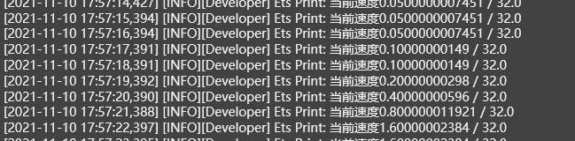
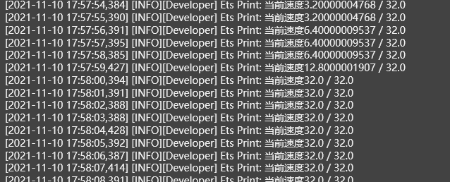
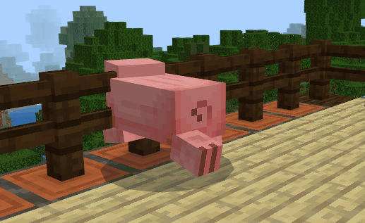

# 最终测试

保存后，我们点击工具栏上的运行按钮，即可开始最终测试。

运行后，我们使用木剑（攻击力小些）攻击猪，可以看到它的速度是每受击一次就翻倍的，符合预期。

当我们持续攻击猪的时候，它的速度越来越快，直到速度超过32时，被限制在了最大值32。

至此，我们的《第一个蓝图Mod》系列教程就结束了，希望大家能通过一步一步跟随这个教程学习，对使用新版逻辑编辑器开发模组有一个初步的认识。欢迎大家尝试新版逻辑编辑器的更多功能，遇到问题时也欢迎随时[反馈给我们](https://mcdev.webapp.163.com/#/feedbackModal?target=browser)!

**完！结！撒！花！**

