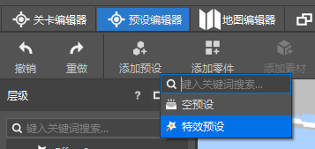
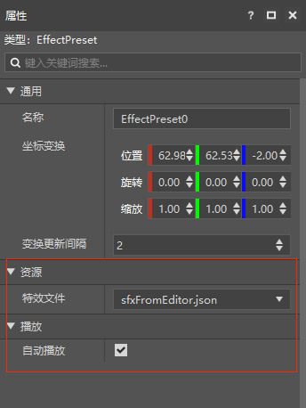
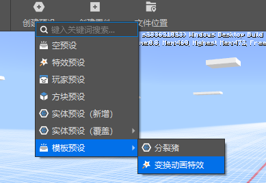
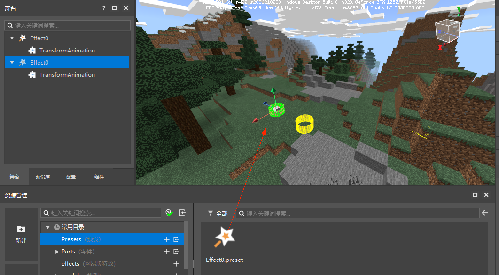
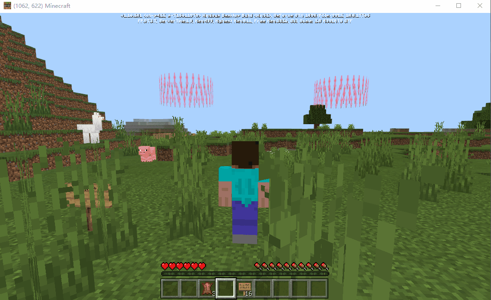

# 特效预设

EffectPreset（特效预设）是一类绑定特效资源的预设，目的是给特效赋予特定的功能，而非制作特效。

有关特效制作的相关知识，请参阅[特效编辑器](../../../../16-美术/9-特效/00-特效编辑器简介.md)的相关文档。

我们提供了内置特效预设，它无需创建既可使用，通过菜单栏=>添加预设=>特效预设进行添加。

特效预设提供特效文件和自动播放属性，你需要通过特效编辑器创建一个粒子/序列帧特效，设置特效文件后方能预览。

如果不勾选自动播放属性，则需要通过零件代码在合适的时机调用播放/停止接口进行手动控制。

你也可以通过菜单栏=>创建预设=>特效预设来创建自己的自定义特效预设。

这里我们选择官方制作好的一个变换动画特效模板来展现自定义特效预设可以实现什么样的效果。

通过菜单栏=>创建预设=>模板预设=>变换动画特效我们可以添加这个模板预设。

创建好的特效预设可以很方便的从资源管理器或预设库中拖到场景内进行实例化，通过预览，我们可以把特效拖到我们希望放置的位置上。

点击运行，进入开发包后，我们可以看到这些变换动画特效已经在世界里动了起来。

