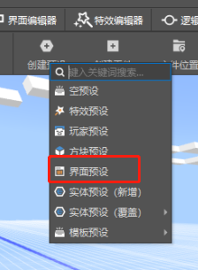
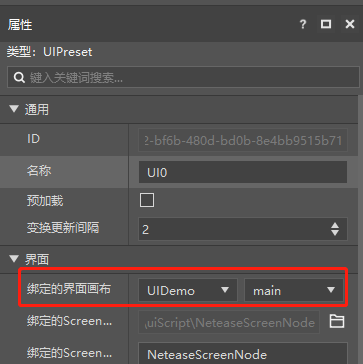
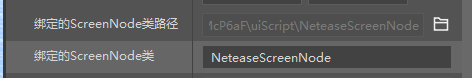
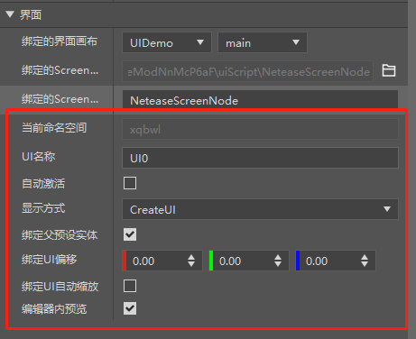
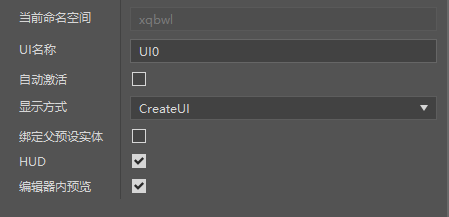
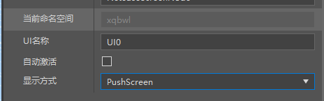
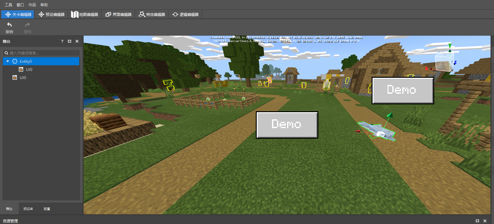

# 界面预设

UIPreset（界面预设）是一类绑定UI资源的预设，目的是给UI赋予预设的属性，如能使UI随着预设的出现而出现、销毁而销毁等。和使用modsdk接口创建UI一样，使用界面预设需要一个UI编辑器制作的UIJson文件和一个继承自ScreenNode的脚本文件。

有关UI制作的相关知识，请参阅[界面编辑器](../../../../18-界面与交互/1-界面编辑器使用说明.md)的相关文档。

在预设编辑器，通过菜单栏=>创建预设=>界面预设我们可以创建一个界面预设。

在编辑器中新建界面预设，选中该预设文件对其进行编辑时，界面预设除了特有的可编辑属性外，公共属性类似空预设。界面预设提供相当多的属性编辑，它们共同决定了界面预设绑定的UI最终展示的属性。

首先需要设置界面预设绑定的UI画布。该设置需要选择想打开的UIJson文件以及该文件中的画布名称。

第二步需要设置界面预设所绑定的继承自ScreenNode的脚本文件以及脚本类名，使用新建文件向导创建的ScreenNode类，其脚本类名默认和脚本文件名相同。

这两步设置完成后，该界面预设就能够成功创建出UI界面。若没有成功创建，请检查界面文件或ScreenNode脚本文件是否有损坏。

后续的设置定义了所打开UI的属性。

| 属性 | 说明 |
| :--- | :--- |
| 当前命名空间 | 当前作品的命名空间，不可编辑 |
| UI名称 | 在当前命名空间中需唯一 |
| 自动激活 | 在界面预设创建完成后是否自动创建UI，若勾选则自动创建，反之则不会自动创建。该设置在预设编辑器内不会生效，界面会被自动激活 |
| 显示方式 | 创建UI的显示方式，有CreateUI和PushScreen两种方式。若选择PushScreen打开UI，则后续属性不可设置，也不会生效 |
| 绑定父预设实体 | 是否绑定预设实体，当父预设为生物预设或玩家预设等有实体的预设时，勾选该属性，UI会被绑定到该实体上。当勾选后，可设置绑定UI的偏移和自动缩放属性，但HUD属性不可设置 |
| HUD |该界面是否允许游戏操作。勾选为允许，不勾选则屏蔽游戏操作 |
| 绑定UI偏移 | 修改与绑定实体之间的偏移量 |
| 绑定UI自动缩放 | 设置已绑定实体的UI是否根据绑定实体与本地玩家间的距离动态缩放 |
| 编辑器内预览 | 在编辑器内设置，控制界面预设所绑定UI的显示隐藏。该属性在非编辑器平台无效。 |

设置好属性后，将该界面预设拖拽至场景中，界面就能显示出来了。

