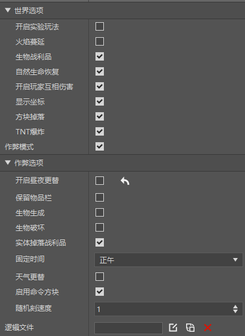

# 世界属性零件

使用时挂在空预设下即可。并且尽量保证这个预设在场景中有且仅有一个实例。

世界选项与旧版关卡编辑器的世界属性组件相同。

>如果需要在游戏中使用脚本调用此零件，可以参考<a href="../../../../../mcguide/20-玩法开发/14-预设玩法编程/13-PresetAPI/预设对象/零件/世界属性零件WorldPart.html" rel="noopenner"> 世界属性零件的API接口文档 </a>