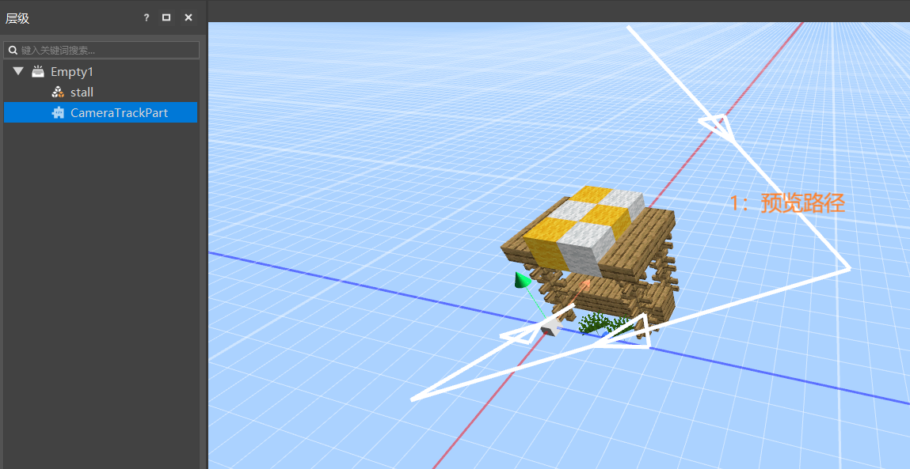
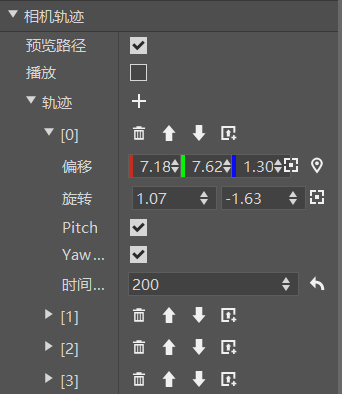
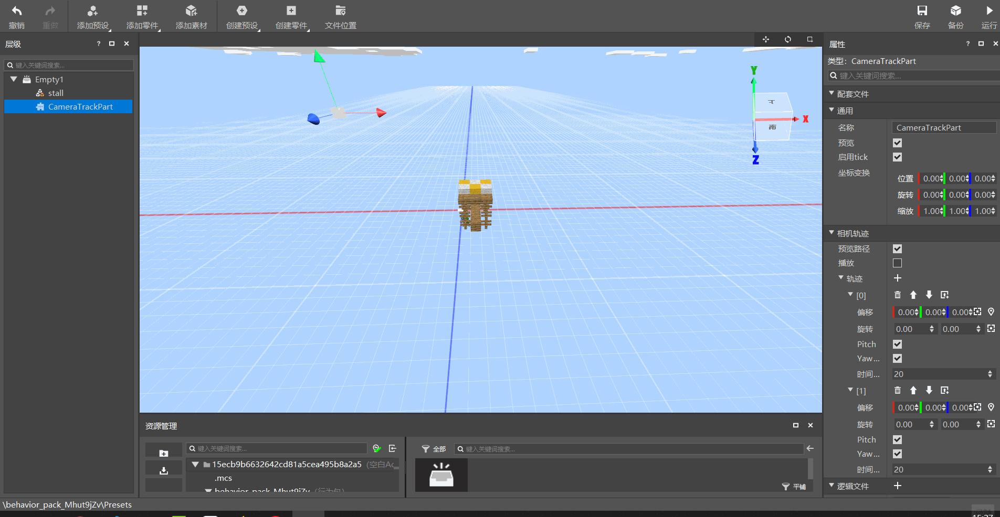

# 相机轨迹零件

相机轨迹零件CameraTrackPart是一个用于制作相机移动和旋转轨迹动画的零件。

为了便于查看效果，这里我们添加一个货摊素材作为参照物，如下图所示。

点击相机轨迹零件，我们可以在属性面板看到其有如下属性:

这里重点解释一下相机轨迹这部分属性：

1. 预览路径：用于控制是否开启预览路径，预览路径就是用线条和箭头在预设场景中显示相机动画的轨迹路线，即上面示意图中的部分。

2.  播放：勾选则在预设场景中播放当前相机轨迹动画。

3.  轨迹：即相机轨迹动画中的每个轨迹点的信息，可以理解为关键帧动画中的某一帧，代表相机在某个时间点须将自身的位置旋转等信息变换到这个轨迹点所代表的状态上。相机轨迹零件的作用就是让玩家能够自由编辑相机的轨迹点信息，从而构成相机动画。可以通过轨迹右侧的"+"按钮新增轨迹点，每个轨迹点的属性如下：

      >偏移：该轨迹点相对于整个相机轨迹零件的位置偏移量
      >
      >旋转：该轨迹点摄像机相对于正北方向的旋转弧度（上下弧度，左右弧度）
      >
      >Pitch（俯仰角）顺向：控制上下方向的顺逆
      >
      >Yaw（偏航角）顺向：控制左右方向的顺逆
      >
      >时间：上一个轨迹点到当前轨迹点所需时间，越长，相机变换的速度越缓慢

4.  轨迹点操作方式：

1. 轨迹点顶部按钮，可以快捷执行删除轨迹点、上移轨迹点、下移轨迹点、上方新建轨迹点四种操作。
2. 轨迹点的偏移和旋转属性右侧提供了记录当前摄像头信息和定位的快捷操作按钮

>记录当前摄像头信息：将预设场景界面的摄像头信息记录在当前轨迹点，当前支持记录位置和旋转两种信息。
>
>定位：在预设场景展示该轨迹点的坐标，并提供坐标轴供玩家进行可视化操作来调整轨迹点的位置信息。

充分熟悉上述操作方式后，我们能够更快速和便捷地进行相机轨迹动画的创作，并随时进行路径的预览和播放，如下图所示

>如果需要在游戏中使用脚本调用此零件，可以参考<a href="../../../../../mcguide/20-玩法开发/14-预设玩法编程/13-PresetAPI/预设对象/零件/相机轨迹CameraTrackPart.html" rel="noopenner"> 相机轨迹零件的API接口文档 </a>