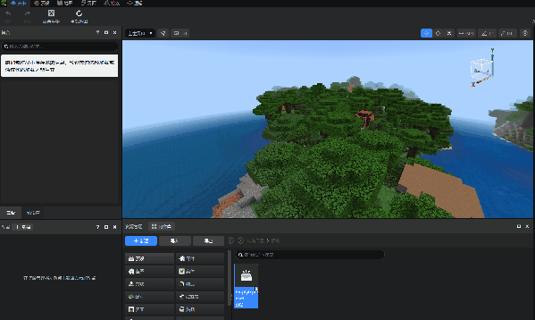
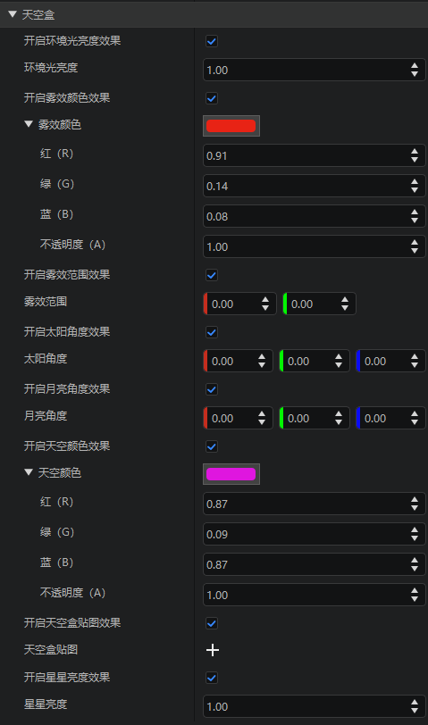
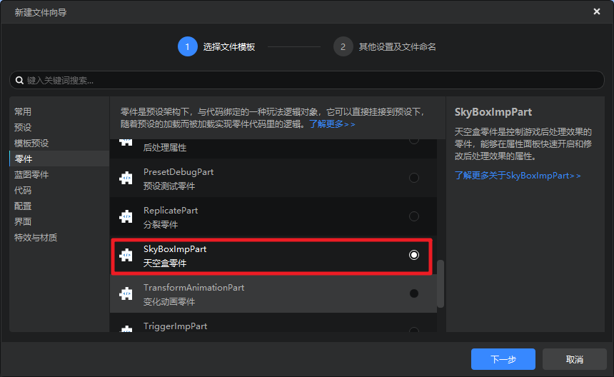
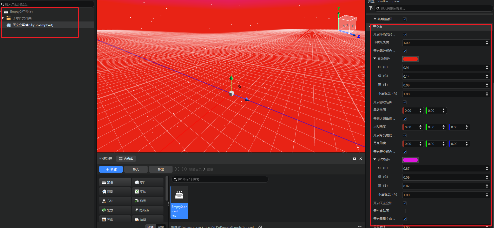
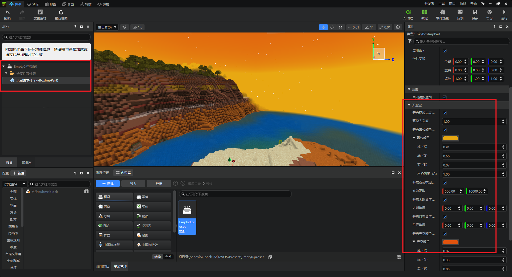
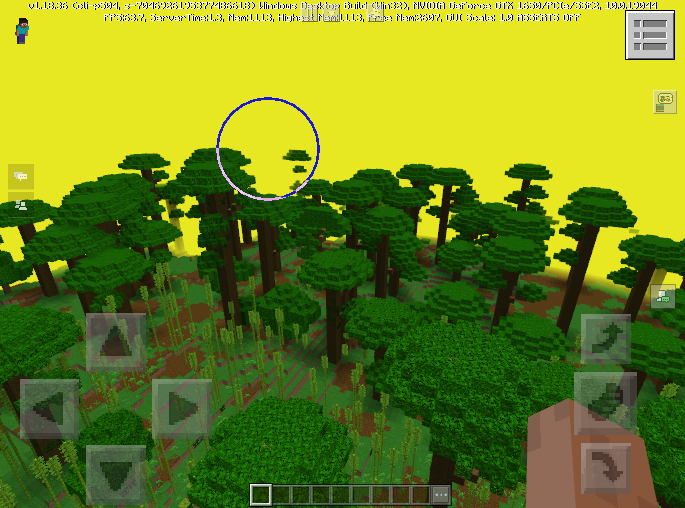

# 天空盒零件
天空盒零件SkyBoxPart用于快速设置天空颜色、贴图、雾效颜色、范围、星星、太阳、月亮等天空相关的表现参数，如下图所示。

## 属性
天空盒零件具有下图中的属性，所有属性均对应了ModSDK中的相关接口，详情参考<a href="../../../../../mcdocs/1-ModAPI/接口/世界/渲染.html#setambientbrightness" rel="noopenner">SetEnableVignette</a>

## 使用
1. 在新建文件向导创建天空盒零件

2. 创建一个预设并将零件挂接到预设下，调整对应属性

3. 将预设拖到场景舞台生成实例，即可生效

4. 编辑实例下的属性也可实时调整对应效果。

5. 运行测试查看效果

