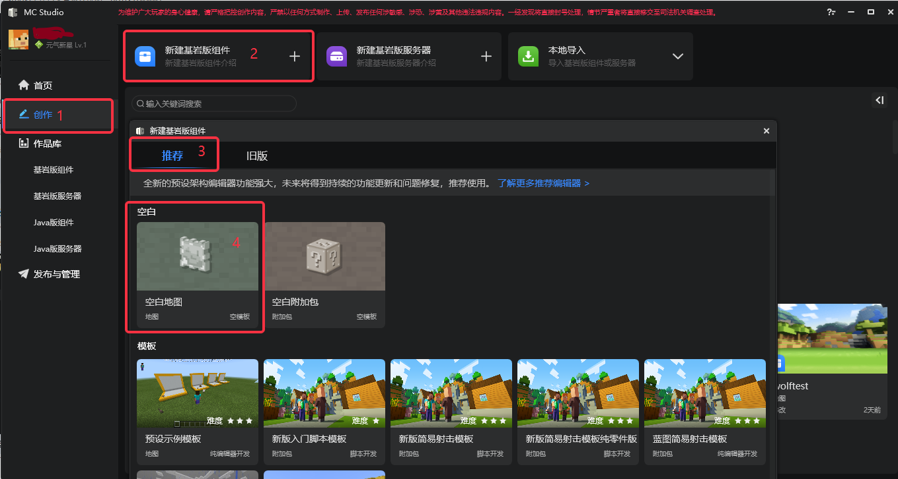
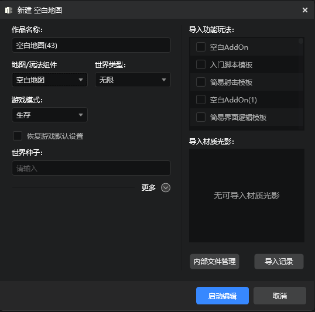
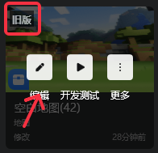
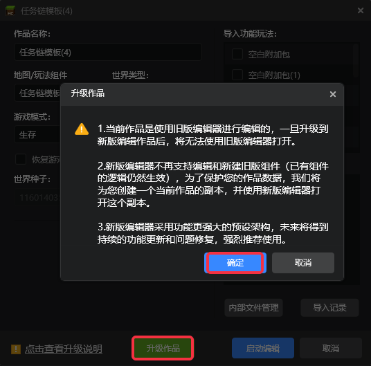

# 创建新版作品

我们建议您跟随这个文档一步步的创建出第一个预设Mod。你可以在这里下载到已经制作完成的<a href="https://g79.gdl.netease.com/FirstPresetDemo.zip" target="_blank" rel="noopener noreferrer">第一个预设Mod</a>用于参考。

新版编辑器提供了预设架构等一系列对于玩法开发威力强大的工具。想要使用这些工具，我们需要先创建一个使用新版编辑器的作品。
## 新建新版作品

我们在启动器的`创作`分页下点击`新建基岩版组件`按钮，在新建弹窗中选择`推荐`分页下的空白地图并点击，创建一个新的地图玩法组件。

> `推荐`分页下创建的作品会使用全新预设架构的编辑器，功能强大，且未来会得到持续的功能更新和问题修复，推荐开发者优先选择使用。

在弹出的新建作品的界面，设置好作品名称、世界类型等参数，点击`启动编辑`，即可创建和编辑一个新版作品了。

## 将旧版作品升级为新版

在当鼠标悬浮在作品卡片上时，旧版作品的左上角会有标签提示，如下图所示

点击编辑按钮，在弹出的编辑作品面板中，开发者可以选择将旧版作品升级为新版作品，如下图所示。

> **注意**：
> 1.当前作品是使用旧版编辑器进行编辑的，一旦升级到新版编辑作品后，将无法使用旧版编辑器打开。
> 2.新版编辑器不再支持编辑和新建旧版组件（已有组件的逻辑仍然生效），为了保护您的作品数据，我们将为您创建一个当前作品的副本，并使用新版编辑器打开这个副本。
> 3.新版编辑器采用功能更强大的预设架构，未来将得到持续的功能更新和问题修复，强烈推荐使用。

只有旧版作品可以被升级为新版，新版作品在编辑时，直接点击启动编辑即可用新版编辑器打开。

