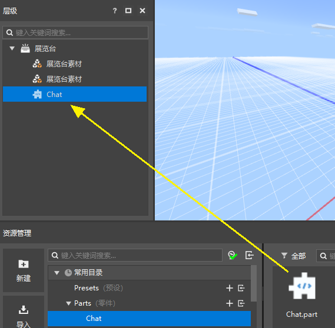
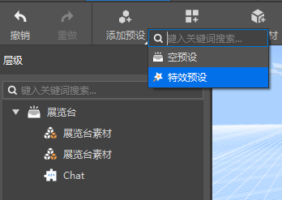
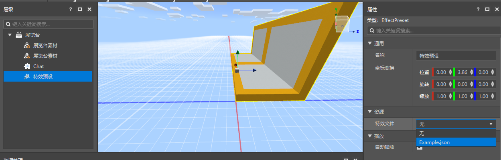
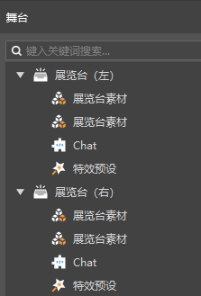

# 拼装预设和零件

## 零件挂接

我们先不急于对零件的ChatPart.py进行修改，先双击打开Cabinet.preset，并且在预设编辑器中，将Chat零件拖拽至展览台预设的层次面板中，如下图所示。

由于我们希望实现的零件逻辑与位置无关，所以无需调节零件的位置。

## 挂接子预设

除了零件之外，我们再通过预设编辑器的添加一个子预设。在预设编辑器中点击添加预设，在弹出的菜单中选择特效预设。

然后在资源管理器的常用目录中，找到effects，点击“+”，创建一个粒子特效。

在层级面板中选中特效预设，并在他的属性面板中，将特效文件修改为我们刚创建好的新特效，现在特效就开始播放了。

你可以在预览窗中，为你的粒子调整到一个合适的位置。

然后，返回关卡编辑器，我们可以看到展览台预设的实例均已得到更新。

需要注意的是，预设架构下，所有的预设/零件，只有以实例的方式出现在场景（舞台）上，才可以生效。

如果你创建了一个预设，或者一个实例，但是没有把它放置在场景中，或者通过其他方式在场景中生成实例，那么他永远不会生效。
