# 从零开始创建UI界面

这篇教程会详细介绍如何通过工作台内嵌的UI编辑器，创建一个基础的FPS战斗界面。教程包括界面控件的创建（包含面板，图片和按钮）以及按钮相关的逻辑绑定。将按照以下步骤来进行介绍：
* 如何根据自己的需要使用UI编辑器进行界面编辑和保存
* 如何根据json中的内容进行按钮逻辑python的相关绑定

## 使用UI编辑器

我们的目的是制作一个简易射击模板。

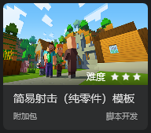

实现这个模板手机版界面的部分功能。

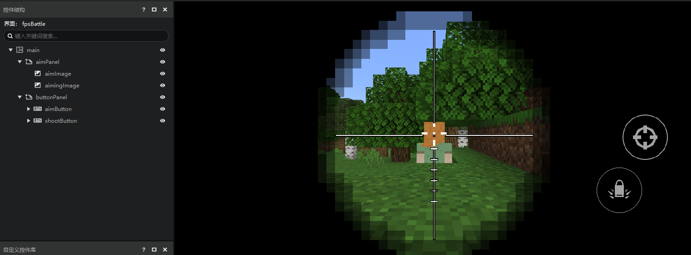

### 进入UI编辑器

打开MC 工作台，我们点击创建空白AddOn。

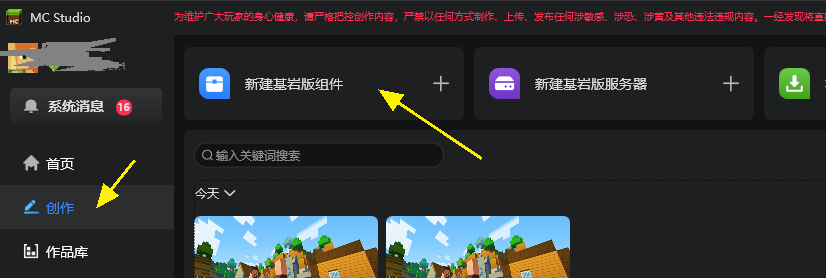

选择空白附加包，在弹出的“新建空白附加包”弹窗中填写信息，并点击启动编辑以进入编辑器。

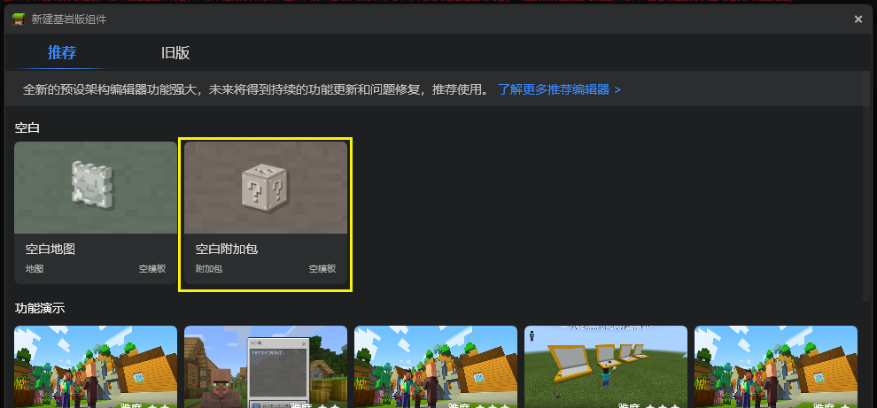

进入编辑器后，你需要先通过顶部页签切换到“界面”，以打开界面编辑器，如下图：

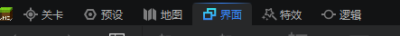

### 导入UI资源
首先，我们把制作界面需要的图片通过UI编辑器的资源管理器窗口，选择图片文件导入。如下图。

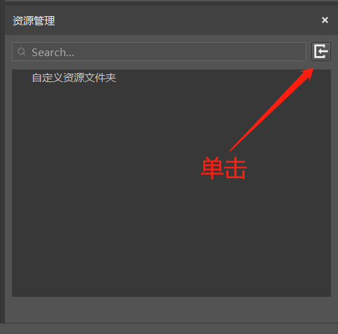

注意，目前我们仅支持png格式的图片文件，此外，图片名称仅支持以数字、字母、下划线组成的名称，该命名规则也是整个UI编辑器通用的命名规则，若不满足以上规则，资源导入会失败。

界面需要的图片资源可以点击这里下载：[简易射击模板界面贴图资源](https://g79.gdl.netease.com/awesome_ui_textures.zip)。

成功导入图片后的资源管理窗口如下图所示，在资源管理器的精简模式中切换到贴图，可以看到所有的贴图。

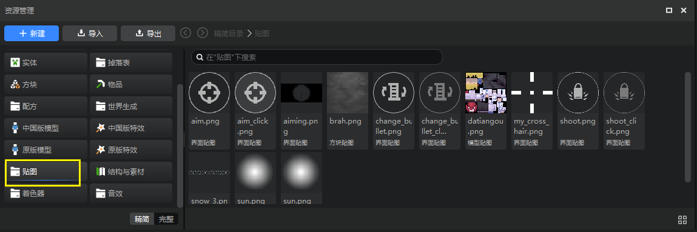

如果你使用完整模式的话，UI的贴图在这个目录（根目录\resourcepack（资源包）\textures\ui）。关于资源管理的更多内容请参考[文件结构](../15-资源管理/2-文件结构.md)。

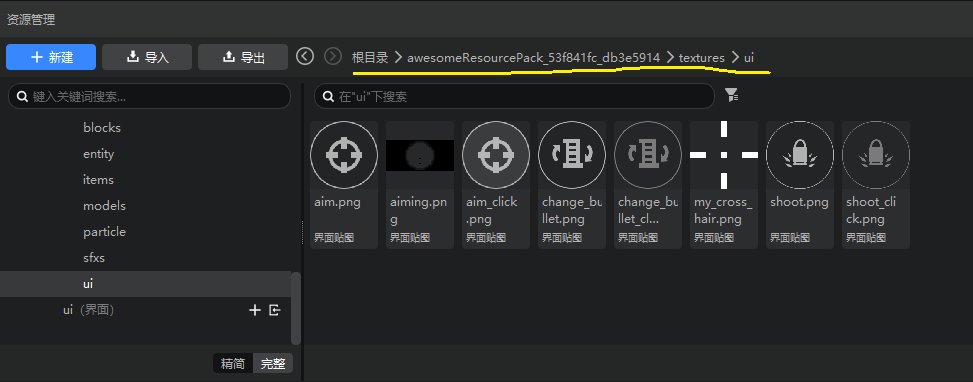

> 精简模式的贴图没有区分具体用处，展示的是所有作品目录中的贴图。你可以使用其他目录中的贴图，如果他不在ui文件夹下，编辑器会自动帮你复制一份到ui文件夹。

### 新建UI文件

现在让我们来创建一个界面文件：

1. 使用资源管理器的新建按钮
2. 在弹出的新建文件向导弹窗中选择界面文件，点击下一步
3. 填写文件命名，这里我们命名为fpsBattle，并点击创建

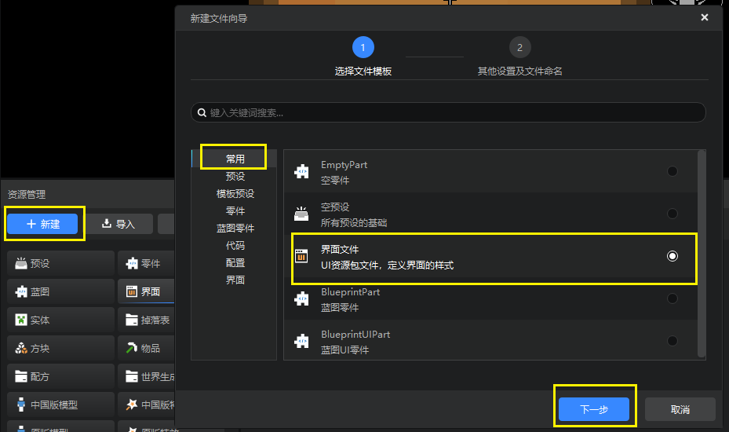

新建UI文件成功后，UI编辑器会自动载入该UI文件的编辑模式，并自带main画布，整体界面如下图所示。你可以将资源管理器（精简模式）切换到界面，这里将显示所有的界面文件。

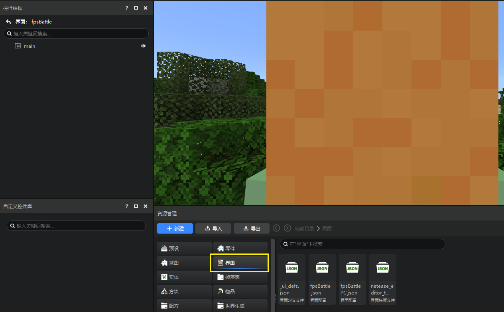

如果你喜欢完整模式，界面文件的路径（根目录\resourcepack（资源包）\ui）如下图。

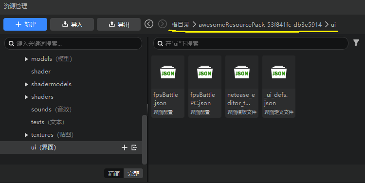

如你所见，预览窗正中间的巨大的黄色像素块是艾利克斯的可爱的后脑勺。如果你想专注于界面编辑，不想被游戏干扰，你可以关闭“显示游戏画面”这个选项。

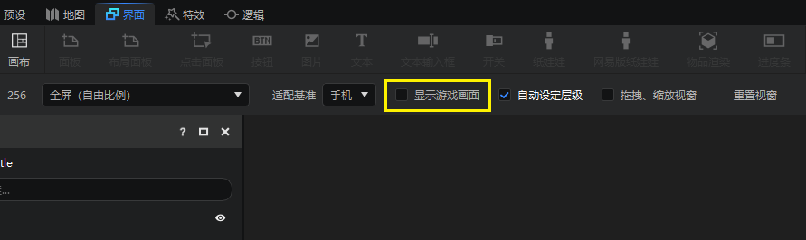

### 创建panel面板控件

首先，我们先创建两个面板（panel）。面板是所有控件中最基础的一个，除去通用属性外，没有任何专属属性，主要用于控件归纳，就如同文件夹一样。创建面板和创建所有其他控件一样，我们鼠标左键单击选中main，然后右键点击弹出菜单，选择"添加对象"-"面板"，如下图。

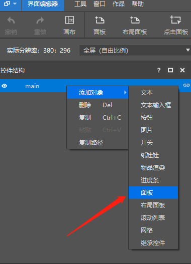

或者将控件库中的面板控件直接拖拽到控件结构的main控件上，完成创建，如下图。

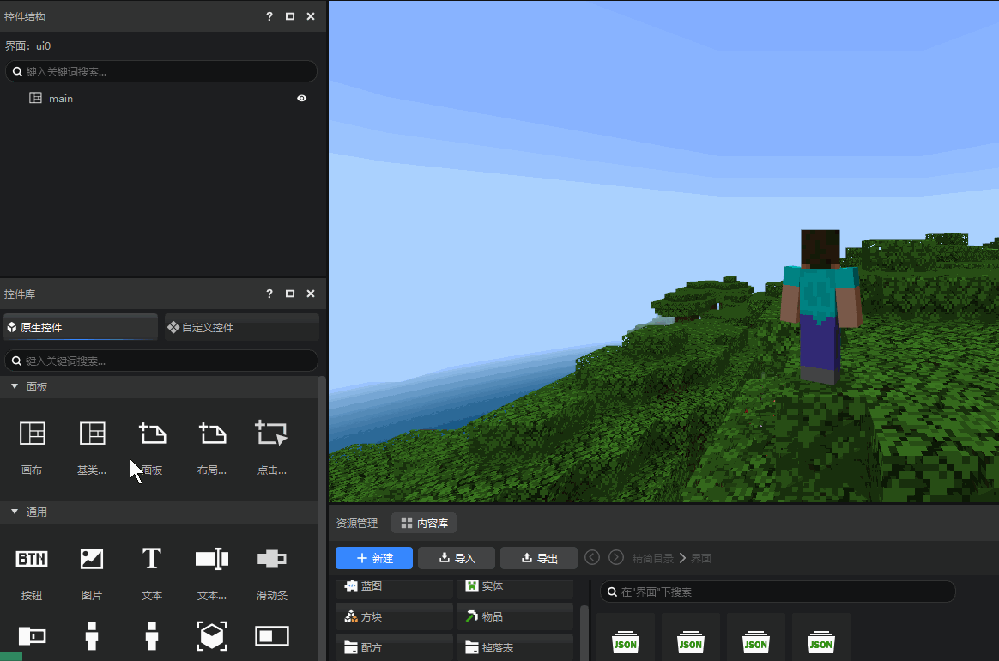

还可以先选中控件结构中的main，然后直接将面板拖拽到预览窗中，如下图。

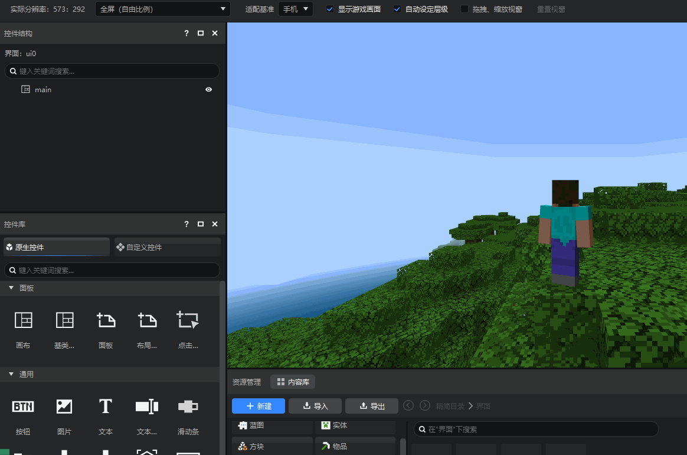

### 重命名控件
创建完毕后对两个面板进行重命名操作，点击选中需要重命名的面板，在右侧的属性面板中修改它的名称，如下图。将其重命名为aimPanel，buttonPanel分别用来存放准心图片控件和所有按钮控件。

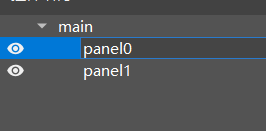

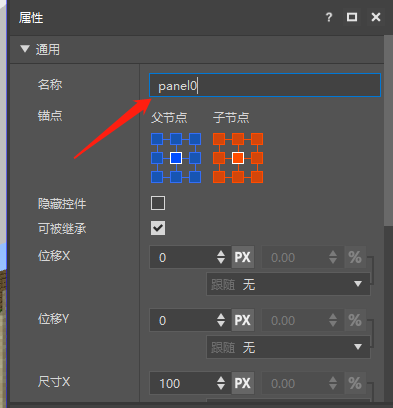

### 创建准心图片控件
面板创建成功后，我们来创建准心，准心通常是一张图片，和新建面板一样我们选中aimPanel并新建一个图片控件，这样新建的控件将会将aimPanel作为父节点。然后将其重命名为aimImage，如下图。

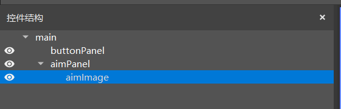

创建完成之后，选中该图片控件，我们要替换它的图片，往下滑动属性窗口至"图片"这一栏，我们将先前导入图片资源拖拽到贴图设置处进行赋值，完成后场景中的图片就会由默认图片显示变为我们导入的图片显示，如下图。

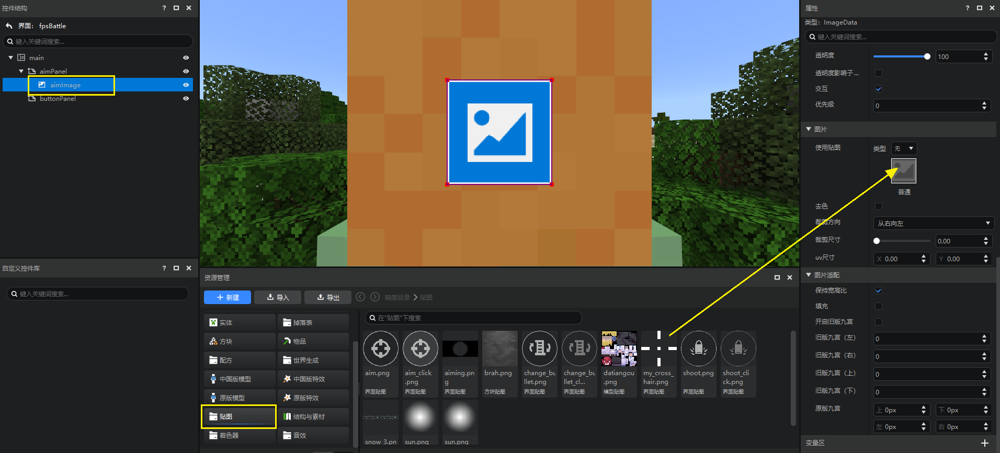

图片设置后，我们就可以通过调整锚点、尺寸和位移调整该控件相对于父节点的位置。这三个属性描述如下：

锚点：每个控件有9个定位点，包括四个角、四边的中点、中心点，锚点可以设定子控件的哪个定位点和父控件的哪个定位点重合，下图中左侧对应父控件、右侧对应子控件。

位移：位移用于控制该控件相对于锚点位置的偏移。位移的形式为%+Px。%表示父控件尺寸的百分比，Px表示像素。

尺寸：尺寸为控件的宽（X）和高（Y）。也是%+Px的形式，其意义同位移。

一般来说，控件的偏移和尺寸均用Px配置即可，比较复杂的情况才需要用到%。这里我们只是简要概括一下控件属性的作用和用法，详情请前往阅读[控件和控件属性](./10-控件和控件属性.md)。

我们分别如下调整aimPanel和aimImage，设置后的界面如下图所示：

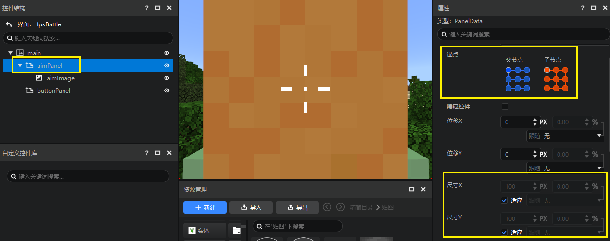

<center>aimPanel属性</center><br>

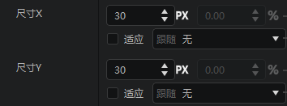

<center>aimImage属性</center>

### 创建瞄准按钮控件
准心完成之后，我们随后来制作瞄准按钮。选中buttonPanel并以该节点作为父节点创建一个按钮控件，并命名为aimButton，步骤等同于创建图片控件。

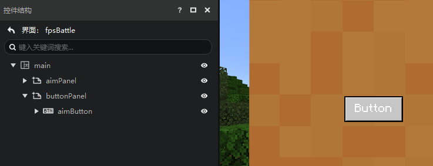

设置一下buttonPanel的属性，与aimPanel的相同，不再单独截图。

设置aimButton的属性如下图。

> 位移XY的取值正负均可
>
> - 对于位移X来说，**正数表示向右位移**，负数表示向左位移
> - 对于位移Y来说，**正数表示向下位移**，负数表示向上位移

由于我们的锚点定在右下角，所以我们需要这个按钮相对于锚点像左上位移，即位移XY的最终取值都需要是负数。

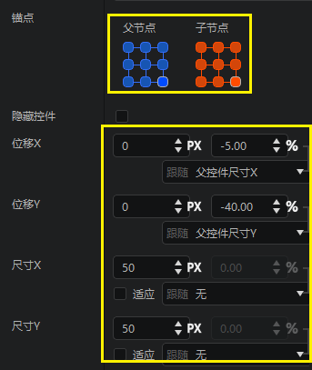

<center>aimButton属性</center>

这样设置可以保证无论是比例，分辨率的屏幕，这个按钮始终在中间靠右的地方，并且外框大小成正方形。

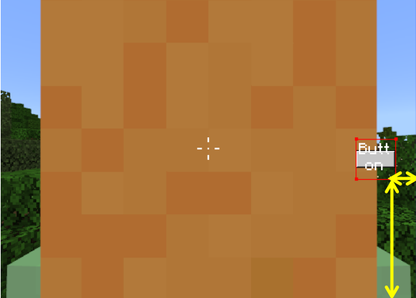

和图片控件不同的是，按钮控件有三种图片状态可供设置，分别对应默认状态，按下状态和鼠标悬浮状态，对于鼠标悬浮状态，我们使用和按下状态一样的图片，如下拖动图片到对应的贴图位置，两个状态的图片分别是：

- 普通贴图：aim.png
- 按下贴图：aim_click.png

另外，因为瞄准按钮不需要按钮文字，我们顺便可以把按钮属性中的按钮文本设置为空。

因为我们要制作的是手机版的界面，不关注悬停的纹理（如果是电脑版，则悬停图片也是必须提供的）。

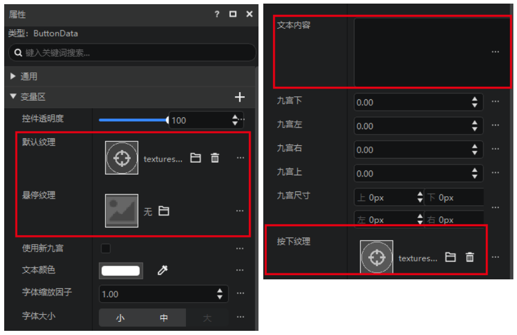

目前为止，你的界面应该是这样的：

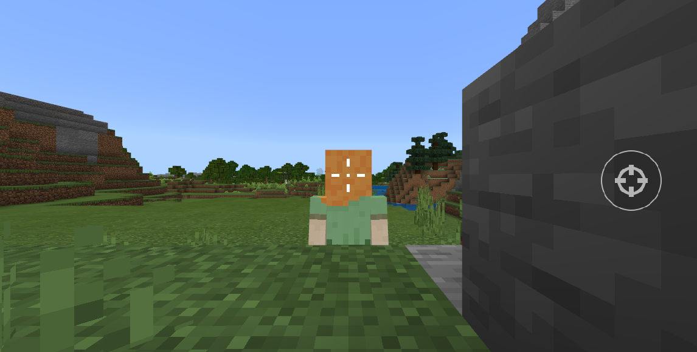

### 创建瞄准镜控件

接下来我们制作瞄准镜图片控件aimingImage，将aimPanel作为父节点创建图片控件，创建完成之后，勾选尺寸XY的适应，可以使图片铺满屏幕。


拖动瞄准镜图片赋值，如下图。

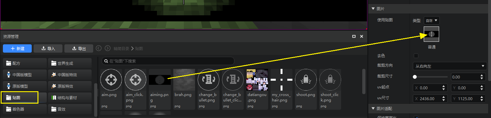

赋值完成后界面如下图。

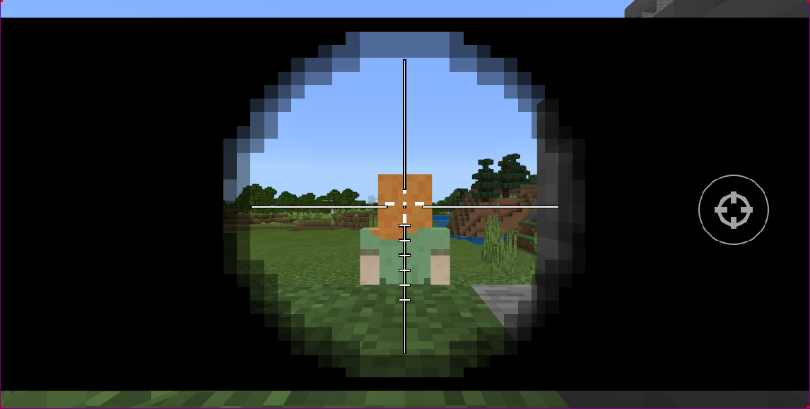

默认情况下，UI系统会默认保证图片的原生比例，如上图，你需要将图片的保持宽高比勾掉。

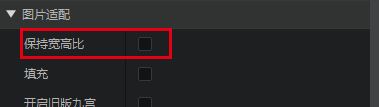

### 调整层级

如果你的瞄准镜图片挡住了你的瞄准按钮，那可能是因为你的aimPanel挡住了buttonPanel。请保证你的buttonPanel在aimPanel的下方，编辑器的规则是下方的控件会挡住上方，只有下面这种顺序才能保证瞄准按钮可以正常挡住其他控件。

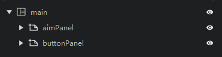

如果你不希望控件的遮挡关系被控件的顺序控制，那么你需要勾掉自动设定层级。

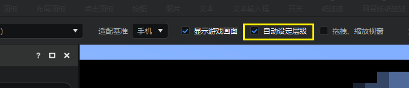

取消自动层级之后，你可以在属性面板手动修改层级属性。层级较大的界面会遮挡层级较小的界面。

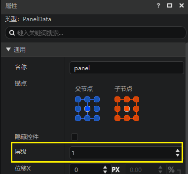

注意：自动层级一旦取消勾选之后将无法再重新勾选。

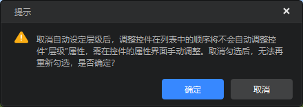


### 完善我们的UI
以此类推，我们在buttonPanel下新建shootButton模拟左键射击按钮，调整它们的锚点、大小和位置，使之到达正确的位置，如下图。


shootButton的锚点，位移XY，尺寸XY的参考属性如下。按照这种方法填写，可以确保在屏幕拉伸或者收缩后，shootButton和aimButton两个按钮控件相对与buttonPanel的位置和大小正常变化。你可以将编辑器内的预览窗拖拽缩放，以观察这个效果。

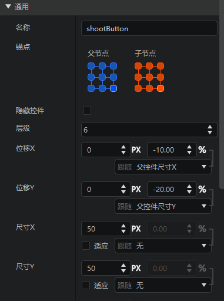

### 保存UI文件

界面完成之后点击右上角保存按钮，如下图，UI文件制作完成。

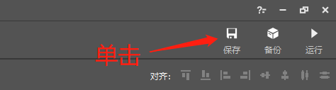

保存成功后，fpsBattls.json文件会输出到mod存档资源包的ui文件夹下，如下图。

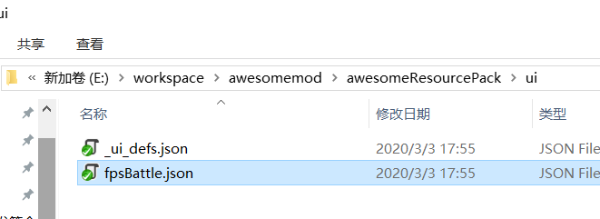

## 创建python逻辑
从上一部分的描述中我们可以得知，UI编辑器制作的json文件只负责界面布局，以及各个控件属性的初始状态。而游戏中的UI除了布局还包含具体的界面逻辑，这就需要我们通过python代码加以实现。

此文档主要关注界面创建，代码部分可以参考工作台的模板。


我们打开关卡编辑器，在舞台中可以看到常驻底下有一个UI逻辑零件和PE版UI界面。

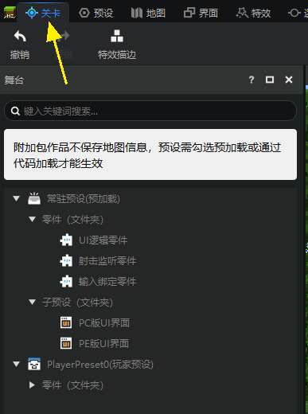

在舞台上点击“PE版UI界面”，可以在他的属性面板中看到，这个界面预设绑定了我们刚刚创建的这个界面文件。关于界面预设的用法详见：[界面预设](../20-玩法开发/14-预设玩法编程/0-理解预设系统/10-预设/5-界面预设.md)。

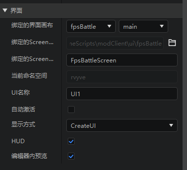

在舞台上点击“UI逻辑零件”，在属性面板中点击配套文件 - 脚本 - 打开文件按钮，可以打开他的脚本文件。

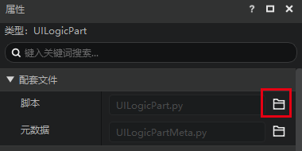

下面的代码片段是截取自这个脚本，实现的效果是

1. 在引擎的OnUIInitFinished事件触发时
2. 获取当前Mod运行的平台（PC或者PE）
3. 然后激活（显示）对应的界面预设

```python
def InitClient(self):
    import mod.client.extraClientApi as clientApi
    self.ListenForEngineEvent(UiInitFinishedEvent, self, self.OnUIInitFinished)
```

```python
def OnUIInitFinished(self, args):
    import mod.client.extraClientApi as clientApi
    if clientApi.GetPlatform() == 0:
        uiNodePreset = self.GetParent().GetChildPresetsByName("PC版UI界面")[0]
    else:
        uiNodePreset = self.GetParent().GetChildPresetsByName("PE版UI界面")[0]
    if uiNodePreset:
        uiNodePreset.SetUiActive(True)
```

我们利用[UI API文档](40-UIAPI文档.html)中对各个控件的接口和游戏原生支持的格式化，可以在python代码中动态的改变界面的表现，具体可以参考[样式代码](https://minecraft-zh.gamepedia.com/index.php?title=%E6%A0%B7%E5%BC%8F%E4%BB%A3%E7%A0%81&variant=zh)

当然，更多API功能还需要你的发现和尝试。
